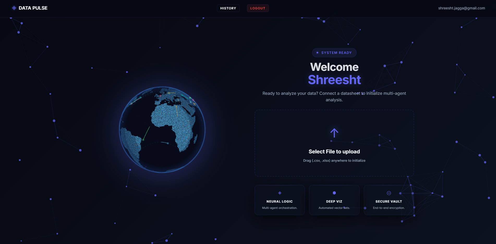
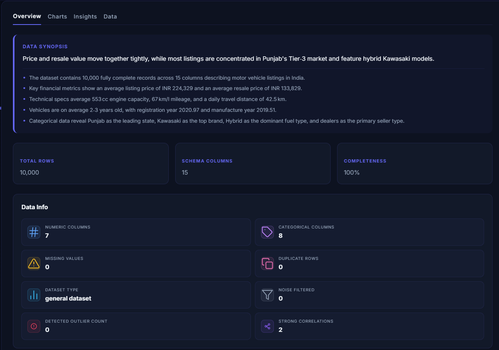
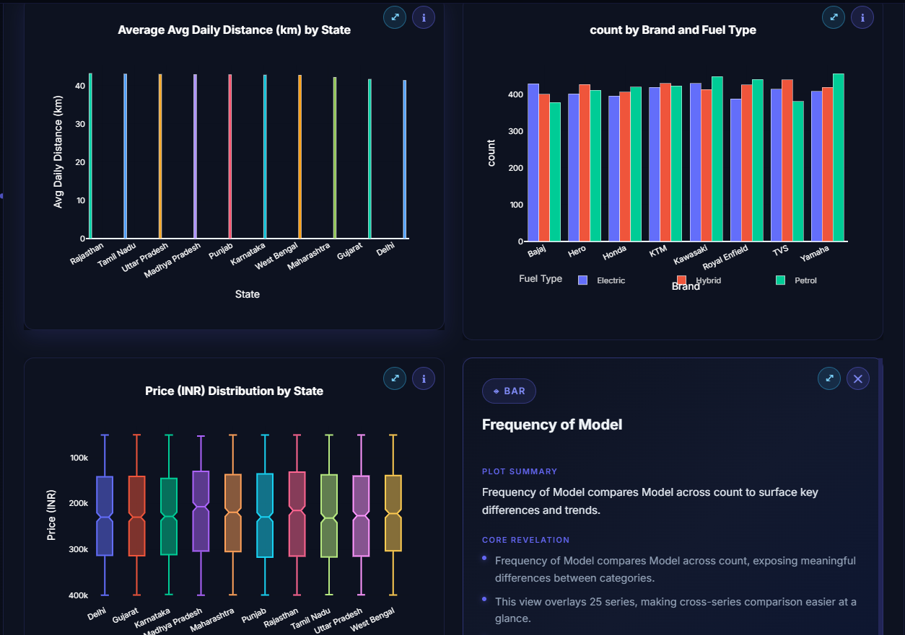
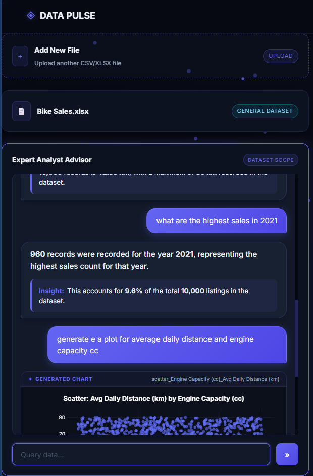

# DataPulse: Agentic AI Data Analysis Platform

DataPulse is a full-stack Agentic AI platform that transforms raw CSV and Excel files into interactive data analysis dashboards.

It automatically cleans data, calculates statistics, generates visualizations, and produces insights using a coordinated multi-agent pipeline. Users can also chat with their dataset, request charts, and ask questions about existing visualizations.

## Features

- Multi-agent data analysis pipeline
- Automatic data cleaning and preprocessing
- Statistical analysis, correlations, and outlier detection
- Automatic Plotly chart generation
- AI-generated insights and recommendations
- Natural-language chat with datasets
- On-demand chart generation through chat
- Grounded answers using real pandas computations
- LLM fallback handling
- Analysis history and caching
- CSV and XLSX support

## Technologies

- Python
- FastAPI
- React
- Pandas
- NumPy
- SciPy
- Plotly
- Groq API
- PostgreSQL / SQLite
- Redis
- Supabase
- Docker

## Architecture

```text
CSV / Excel Upload
        |
        v
+-------------------+
| Architect Agent   |
| Cleaning + Schema |
+---------+---------+
          |
          v
+-------------------+
| Statistician      |
| Statistics +      |
| Outliers +        |
| Correlations      |
+---------+---------+
          |
       +--+--+
       |     |
       v     v
+----------+ +----------+
|Visualizer| | Insights |
|  Agent   | |  Agent   |
+----+-----+ +----+-----+
     |            |
     +-----+------+
           |
           v
       Dashboard
           |
           v
      Chat Engine
```

## Project Structure

```text
Data-Analysis-MultiAgent/
├── backend/
│   ├── agents/
│   │   ├── architect.py
│   │   ├── statistician.py
│   │   ├── visualizer.py
│   │   ├── plot_generator.py
│   │   └── insights.py
│   ├── core/
│   │   ├── graph.py
│   │   ├── chat_engine.py
│   │   ├── data_agent.py
│   │   ├── pandas_executor.py
│   │   ├── llm_client.py
│   │   ├── cache.py
│   │   ├── upload_parsing.py
│   │   ├── utils.py
│   │   ├── state.py
│   │   ├── constants.py
│   │   ├── errors.py
│   │   └── logging_config.py
│   ├── models/
│   ├── storage/
│   ├── api.py
│   ├── auth.py
│   ├── db.py
│   ├── analysis_history.py
│   ├── requirements.txt
│   └── Dockerfile
├── frontend/
│   ├── src/
│   │   ├── components/
│   │   ├── pages/
│   │   ├── App.jsx
│   │   ├── api.js
│   │   ├── main.jsx
│   │   └── index.css
│   ├── index.html
│   ├── package.json
│   ├── package-lock.json
│   ├── vite.config.js
│   └── .env.example
└── images/
    ├── dashboard.png
    ├── overview.png
    ├── charts.png
    └── chat.png
```

## Requirements

- Python 3.11+
- Node.js 18+
- PostgreSQL or SQLite
- Redis (optional)
- Groq API key

## How to Run

### 1. Clone the repository

```bash
git clone https://github.com/shreeshtjagga/Data-Analysis-MultiAgent.git
cd Data-Analysis-MultiAgent
```

### 2. Create environment files

```bash
cp .env.example .env
cp frontend/.env.example frontend/.env
```

### 3. Start the Backend

Open a terminal:

```bash
cd backend

python -m venv .venv
```

Activate the environment.

**macOS / Linux:**

```bash
source .venv/bin/activate
```

**Windows:**

```bash
.venv\Scripts\activate
```

Install dependencies:

```bash
pip install -r requirements.txt
```

Start the backend:

```bash
uvicorn api:app --reload --host 0.0.0.0 --port 8000
```

### 4. Start the Frontend

Open a **second terminal**:

```bash
cd frontend

npm install
npm run dev
```

### 5. Open the Application

```text
Frontend:   http://localhost:5173
Backend:    http://localhost:8000
API Docs:   http://localhost:8000/docs
```

Upload a CSV or XLSX file and start analyzing your data.

## Screenshots

### Dashboard



### Data Overview



### Generated Charts



### AI Data Chat


